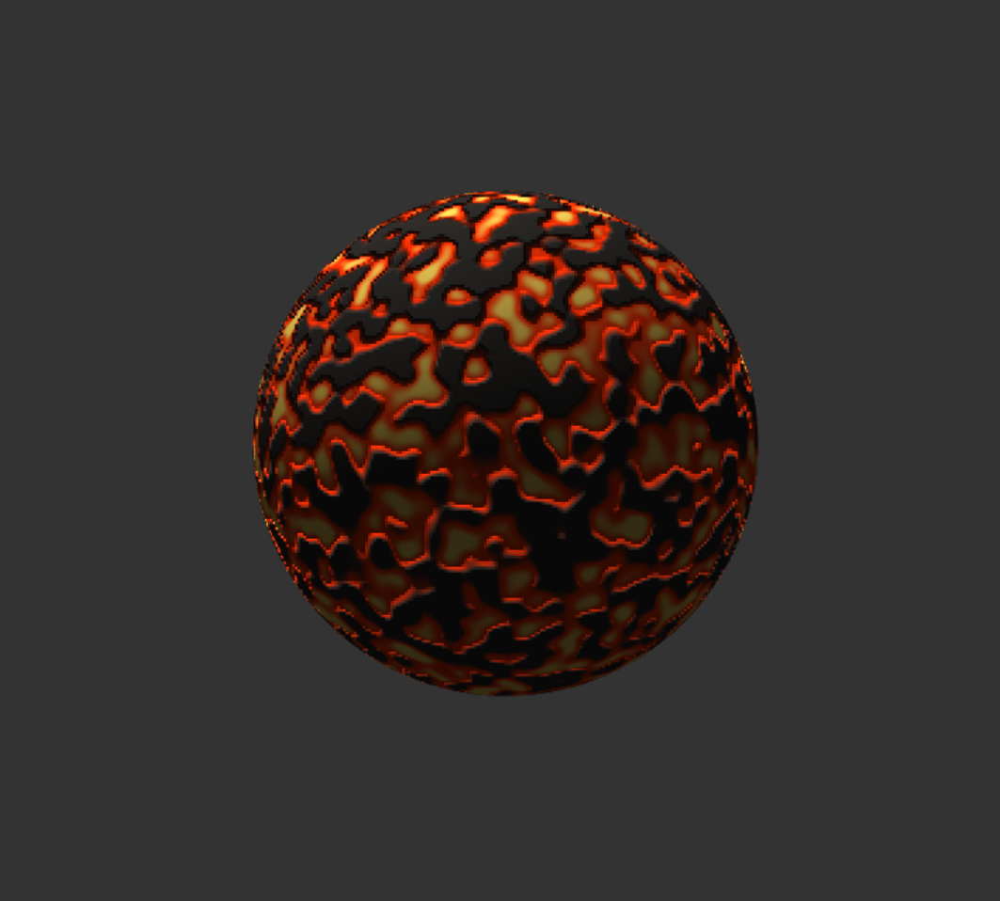
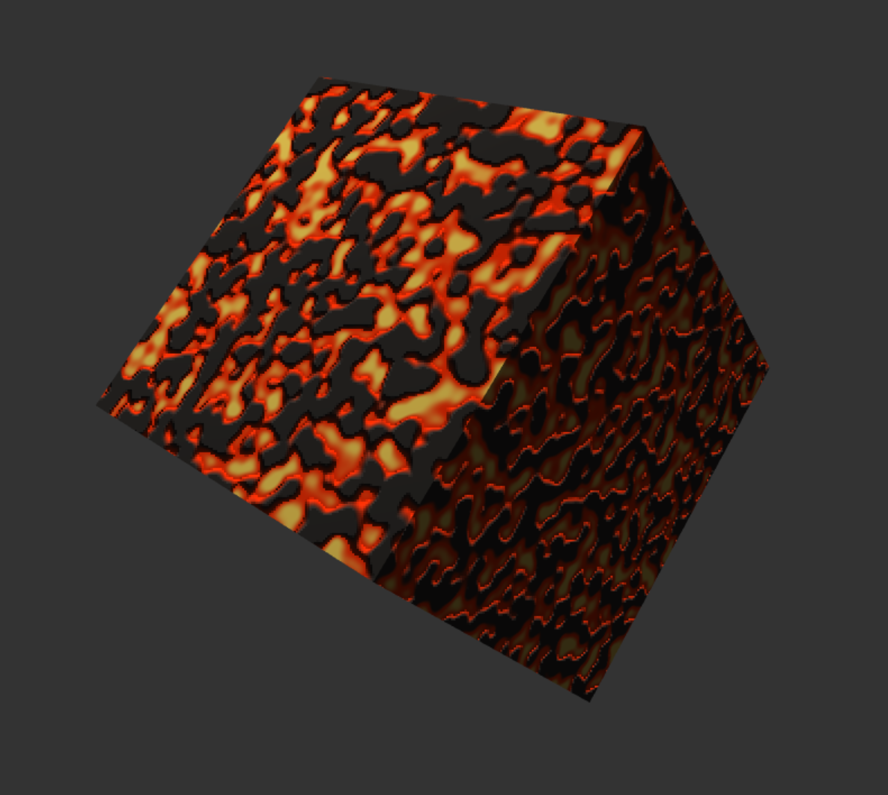
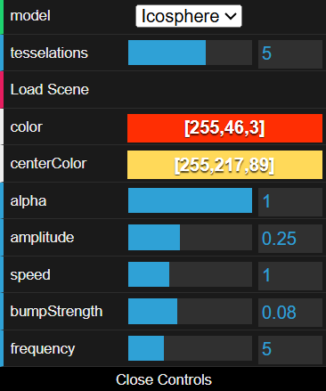
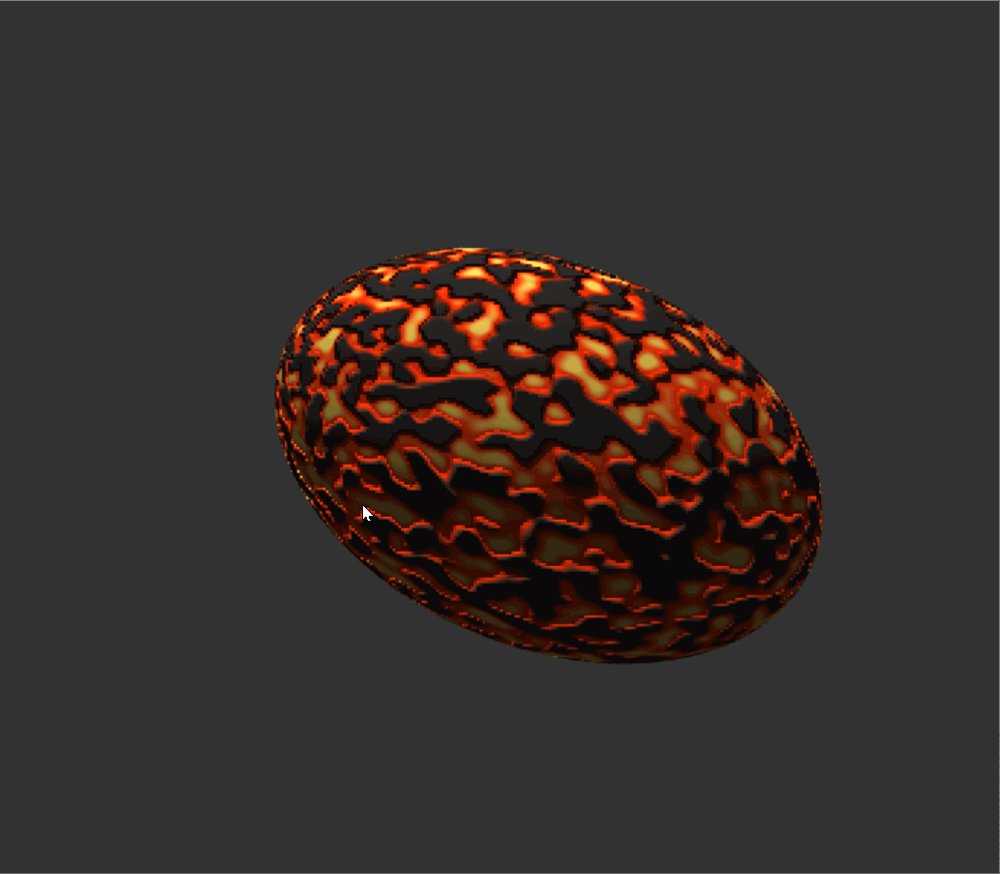
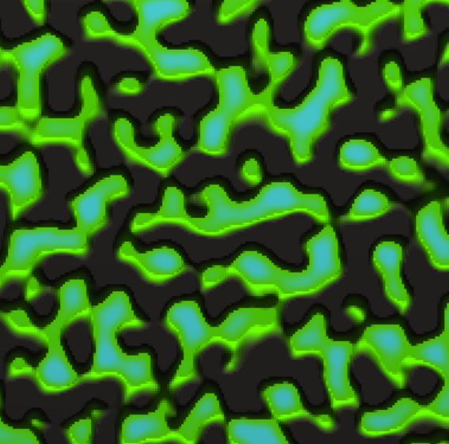

# HW 0: Intro to Javascript and WebGL

This project uses TypeScript and WebGL2 to create an animated lava material. It adds a cube to the starter code, along with custom shaders for the surface color, small bumps, and stretching motion. The default scene is a lava sphere, but you can also try the material on a cube or a square.

[Live Demo](https://JamesLiu12.github.io/hw00-intro-base/)

*Lava sphere*

## Features and Controls

The new `Cube` class extends `Drawable`. It has 24 vertices and 36 indices, with separate normals for each face.

*Lava cube*

The controls update the scene right away:

| Control | What it does |
| --- | --- |
| `model` | Switch between Icosphere, Square, and Cube. |
| `color` | Set the lava color near the edges. The default is orange-red. |
| `centerColor` | Set the color of the hotter parts. The default is light yellow, but it can be changed for other color combinations. |
| `frequency` | Set the pattern density. Higher values make smaller, more frequent lava patches. |
| `bumpStrength` | Set how deep the lava areas look compared with the rock. Set it to 0 to remove the bump effect. |
| `amplitude` | Set the amount of stretching. At 0, the model keeps its original shape. |
| `speed` | Set the animation speed. At 0, the animation pauses at its current shape. |
| `alpha` | Set opacity, from 0 for transparent to 1 for opaque. |
| `tesselations` | Change the sphere's subdivision level. This does not change the cube or square. |
| `Load Scene` | Recreate the models. |

*Controls panel*

## Shader Implementation

### lambert-animate-vert.glsl

A sine function uses the current time to stretch the three axes. Each axis has a different phase, so they do not expand and shrink together. TypeScript updates the time every frame and passes it to the shader.

*Stretching animation*

### lambert-perlin-frag.glsl

A single layer of 3D Perlin Noise gives the lava patches smooth, natural shapes while keeping the code simple.

The hash is based on David Hoskins' [Hash without Sine](https://pyssv.readthedocs.io/en/stable/_modules/random.glsl.html). It is short and generates repeatable values from a 3D grid coordinate without a lookup texture. Its output provides gradient directions for the Perlin function.

The lava look comes from using the noise in three ways:

1. **Rock and lava:** The noise is mapped to 0-1, then `smoothstep(0.45, 0.55, noise)` separates the dark gray rock from the colored lava. This narrow transition makes the patch edges clear.
2. **Hotter centers:** Another `smoothstep`, from 0.55 to 0.7, blends the lava edge color toward `u_CenterColor`. Higher-noise parts inside each patch look hotter.
3. **Recessed lava:** The height comes from `(1.0 - colorMix) * u_BumpStrength`. The rock is higher and the lava is lower. Screen-space derivatives of the height and world position adjust the normal for lighting. This only changes the surface appearance, not the mesh or its outline.

*Lava colors and surface detail in green*

The lighting model is still Lambert diffuse shading.
